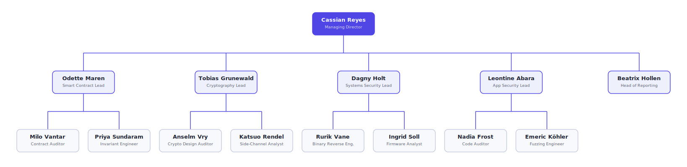

# Citadel Audit Group

A prebuilt deep-audit security verification firm for Ever Works. Citadel takes
a system — a smart contract protocol, a cryptographic library, a closed-source
binary, a production application — and returns a defensible account of what is
broken, how badly, and what to change. It is the verification counterpart to
the defensive advisory firm **Bulwark Security**: where Bulwark scopes ongoing
authorized assessments and turns findings into remediation programs, Citadel
does point-in-time, evidence-first deep audits across four specialist
practices, and ships nothing on assertion — only on proof.

Work arrives at the Managing Director as a Task. He qualifies it, decomposes it
into practice workstreams, and routes each to the practice that owns it. Inside
a practice the lead sets a depth budget and splits the work into a manual lane
and a verification lane (property testing, side-channel analysis, fuzzing,
disassembly). Every suspicion is demonstrated against the real artifact before
it becomes a finding, every confirmed bug triggers a variant sweep, and an
independent Report Editor gates the whole thing on reproducibility, defensible
severity, and concrete remediation.

## Org structure

**Root**

- `managing-director` — Cassian Reyes, Managing Director (reports to no one)

**Practice teams**

- **Smart Contracts Practice** — manager `contracts-lead`; members
  `contract-auditor`, `invariant-engineer`
- **Cryptography Practice** — manager `crypto-lead`; members `crypto-auditor`,
  `sidechannel-analyst`
- **Systems Security Practice** — manager `systems-lead`; members
  `binary-analyst`, `embedded-analyst`
- **Application Security Practice** — manager `appsec-lead`; members
  `code-auditor`, `fuzzing-engineer`

**Agents**

| Agent | Persona | Reports to |
| --- | --- | --- |
| `managing-director` | Cassian Reyes, Managing Director | — (root) |
| `contracts-lead` | Odette Maren, Smart Contract Practice Lead | managing-director |
| `crypto-lead` | Tobias Grunewald, Cryptography Practice Lead | managing-director |
| `systems-lead` | Dagny Holt, Systems Security Practice Lead | managing-director |
| `appsec-lead` | Leontine Abara, Application Security Practice Lead | managing-director |
| `report-editor` | Beatrix Hollen, Head of Reporting | managing-director |
| `contract-auditor` | Milo Vantar, Smart Contract Auditor | contracts-lead |
| `invariant-engineer` | Priya Sundaram, Invariant & Property Engineer | contracts-lead |
| `crypto-auditor` | Anselm Vry, Cryptography Design Auditor | crypto-lead |
| `sidechannel-analyst` | Katsuo Rendel, Side-Channel & Key-Hygiene Analyst | crypto-lead |
| `binary-analyst` | Rurik Vane, Binary Reverse Engineer | systems-lead |
| `embedded-analyst` | Ingrid Soll, Firmware & Embedded Analyst | systems-lead |
| `code-auditor` | Nadia Frost, Application Code Auditor | appsec-lead |
| `fuzzing-engineer` | Emeric Köhler, Fuzzing & Dynamic Analysis Engineer | appsec-lead |

The Report Editor is deliberately teamless — the editorial quality gate has no
stake in any single practice's output looking good.

**Skills** (15): `severity-rubric`, `finding-writeup`, `threat-model`,
`contract-audit-scoping`, `invariant-review`, `variant-sweep`,
`crypto-design-review`, `constant-time-review`, `key-hygiene-audit`,
`binary-triage`, `detection-authoring`, `static-triage`, `fuzzing-plan`,
`crash-triage`, `dependency-risk-review`.

## Curation note

The upstream concept is organized as a firm of roughly 28 agents with a broad
skill library. This adaptation curates it down to a 14-agent core — one root,
four practice leads, an editorial head, and two auditors per practice — and a
focused set of 15 load-bearing skills, keeping the caps satisfied while
preserving the firm's defining shape: specialist practices, evidence-first
auditing, variant sweeps, and an independent reporting gate. Broader personnel
and workflow-tooling roles from the larger org (culture, infrastructure, and
internal skill-development functions) were intentionally left out so the
package stays centered on audit and verification.

## What to expect after import

Importing this package creates the fourteen agents with their reporting lines,
the four practice teams, and the fifteen shared skills. Assign an engagement as
a Task to the Managing Director — a contract audit, a crypto review, a binary
or firmware analysis, or an application assessment. He qualifies and routes it,
the owning practice executes across its two lanes, and the Report Editor
returns an assembled report with reproduced findings, rubric-honest severities,
and concrete remediation.

---

Concept adapted from [Trail of Bits Security](https://github.com/paperclipai/companies/tree/main/trail-of-bits-security)
(and its source, [trailofbits/skills](https://github.com/trailofbits/skills));
all content is original.
