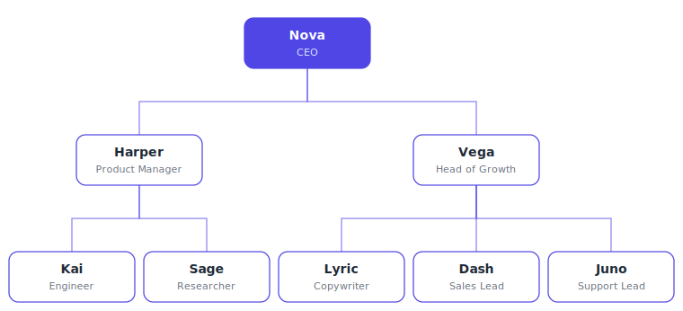

# Ever Starter Co

The flagship general-purpose starter company for any new business. Import it into Ever Works and you get a small, complete organization that already knows how to take an idea from triage to a shipped first launch: a CEO who decides and delegates, a product team that builds and de-risks, and a growth team that reaches and serves customers.

## Org structure

**Nova — CEO** (root) decides, delegates, and unblocks.

- **Product Team** — manager **Harper (pm)**
  - **Kai (coder)** — Engineer: builds and verifies
  - **Sage (researcher)** — Researcher: answers the questions that change the plan
- **Growth Team** — manager **Vega (marketer)**
  - **Lyric (copywriter)** — Copywriter: every written asset
  - **Dash (sales)** — Sales Lead: pipeline and prospect conversations
  - **Juno (support)** — Support Lead: customers answered, themes fed upstream

## Skills included

- **launch-checklist** — systematic go/no-go before anything goes public
- **weekly-status-report** — two-minute decision-ready upward reporting
- **idea-triage** — kill / park / fund verdicts with recorded reasons
- **customer-voice** — verbatim customer language captured, tagged, and put to work

## What to expect after import

Eight agents arrive wired into the reporting lines above, two teams are formed under their managers, and the four skills are attached to the roles that use them. One starter project, **First Launch**, comes pre-loaded with three tasks — plan the MVP (Harper), research the competitor field (Sage), and draft the landing copy (Lyric) — so the company starts working the moment you point it at your idea. Hand Nova your first goal and the loop takes it from there.
