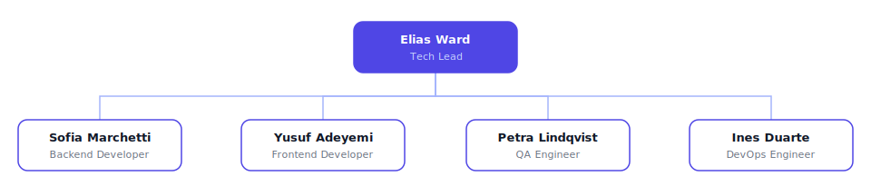

# Forgeline Engineering

A self-organizing engineering company that runs software delivery as a dependency graph: every request is decomposed into blocking-aware tasks before code is written, backend and frontend are built simultaneously in isolated git worktrees against a written interface contract, and every change passes a QA gate before staged, reversible deployment unblocks. The house rule: the graph does the choreography — completing a task is what unblocks the next one.

## Org structure

- **Elias Ward — Tech Lead** (`tech-lead`, root): decomposes requests into dependency-aware task plans, writes the interface contracts that enable parallel builds, signs off on risky plans, arbitrates escalations, and merges completed worktrees in dependency order.
  - **Sofia Marchetti — Backend Developer** (`backend-developer`): builds APIs, data models, migrations, and business logic in an isolated worktree, to the contract, with tests.
  - **Yusuf Adeyemi — Frontend Developer** (`frontend-developer`): builds components, pages, and client state in an isolated worktree, consuming the contract and covering all its states.
  - **Petra Lindqvist — QA Engineer** (`qa-engineer`): holds the review-and-test gate with authority to bounce; her pass is the only thing that unblocks deployment.
  - **Ines Duarte — DevOps Engineer** (`devops-engineer`): takes gate-passed changes through staged deploys with pre-agreed rollback triggers, and keeps CI and infrastructure healthy.

**Team:** Pipeline (managed by the Tech Lead; all four specialists).

**Skills (3):** task-decomposition, worktree-parallelism, review-and-gate.

## Curation note

The upstream organization keeps the same five-role pipeline roster, so no roles were trimmed. Its single skill, however, is a vendor-specific orchestration CLI reference; this adaptation replaces it with three platform-neutral practice playbooks covering the same operating concept — dependency-aware decomposition, parallel work in isolated git worktrees, and a review gate that controls deployment — and folds the source project's newer plan-approval flow into the Tech Lead's sign-off step.

## Credit

Concept adapted from [ClawTeam Engineering](https://github.com/paperclipai/companies/tree/main/clawteam-engineering) (and its source, [HKUDS/ClawTeam](https://github.com/HKUDS/ClawTeam)); all content is original.
