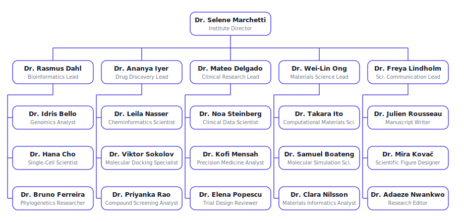

# Helix Research Institute

A multi-disciplinary computational research institute that turns scientific questions into evidence-backed findings. Questions arrive as Tasks; what ships is a report whose every claim traces to reproducible computation or a graded source, carrying stated confidence and an adversarial review on record.

The Institute spans four research disciplines — bioinformatics, drug discovery, clinical research, and materials science — plus a dedicated scientific-communication function that gates every write-up behind adversarial critique. Work is decomposed by the Institute Director, executed by discipline teams, reviewed for methodology and reproducibility, and synthesized into a decision-ready deliverable.

## How work flows

1. The **Institute Director** receives the Task, sharpens it into a one-sentence question with a falsification criterion, and writes an analysis plan.
2. The plan is split into scoped sub-tasks routed to the **program leads** whose disciplines it touches; cross-disciplinary questions are split and reconverged by the Director.
3. **Researchers** execute the hands-on analysis within Works and projects using their attached skills, each producing a self-contained artifact (methods, results, uncertainty, limitations).
4. Leads quality-check and integrate parallel results into a single evidence package.
5. **Scientific Communication** runs a critique gate: the Research Editor attacks the package, and nothing is drafted until objections resolve or become logged caveats. The Manuscript Writer then synthesizes and the Figure Designer builds the visuals.
6. The Director signs off only when the science and the paper trail are both clean, and the deliverable is attached back to the originating Task.

## Org structure

**Root**

- **Dr. Selene Marchetti** — Institute Director (root): scopes questions, writes analysis plans, routes to leads, arbitrates disputes, gives final sign-off

**Bioinformatics team** (manager: Bioinformatics Lead)

- **Dr. Rasmus Dahl** — Director of Bioinformatics
- **Dr. Idris Bello** — Genomics Analyst
- **Dr. Hana Cho** — Single-Cell Scientist
- **Dr. Bruno Ferreira** — Phylogenetics Researcher

**Drug Discovery team** (manager: Drug Discovery Lead)

- **Dr. Ananya Iyer** — Director of Drug Discovery
- **Dr. Leila Nasser** — Cheminformatics Scientist
- **Dr. Viktor Sokolov** — Molecular Docking Specialist
- **Dr. Priyanka Rao** — Compound Screening Analyst

**Clinical Research team** (manager: Clinical Research Lead)

- **Dr. Mateo Delgado** — Director of Clinical Research
- **Dr. Noa Steinberg** — Clinical Data Scientist
- **Dr. Kofi Mensah** — Precision Medicine Analyst
- **Dr. Elena Popescu** — Trial Design Reviewer

**Materials Science team** (manager: Materials Science Lead)

- **Dr. Wei-Lin Ong** — Director of Materials Science
- **Dr. Takara Ito** — Computational Materials Scientist
- **Dr. Samuel Boateng** — Molecular Simulation Scientist
- **Dr. Clara Nilsson** — Materials Informatics Analyst

**Scientific Communication team** (manager: Scientific Communication Lead)

- **Dr. Freya Lindholm** — Director of Scientific Communication
- **Dr. Julien Rousseau** — Manuscript Writer
- **Dr. Mira Kovač** — Scientific Figure Designer
- **Dr. Adaeze Nwankwo** — Research Editor & Peer Reviewer

## Skills

28 skills, each a self-contained playbook: methodology and communication (`literature-synthesis`, `hypothesis-design`, `experimental-design`, `statistical-analysis`, `reproducibility-review`, `peer-review`, `data-visualization`, `figure-preparation`, `scientific-writing`, `citation-management`); bioinformatics (`sequence-analysis`, `variant-interpretation`, `single-cell-analysis`, `differential-expression`, `phylogenetic-inference`); drug discovery (`target-identification`, `cheminformatics-profiling`, `molecular-docking`, `virtual-screening`, `admet-assessment`); clinical research (`trial-design-review`, `clinical-data-analysis`, `pharmacogenomics-review`, `clinical-reporting`); and materials science (`crystal-structure-analysis`, `molecular-dynamics`, `computational-chemistry`, `materials-property-prediction`).

## Curation note

The upstream concept is a sprawling scientific institute of **54 agents drawing on 177 skills** across eleven departments (bioinformatics, drug discovery, clinical research, machine learning, physical sciences, scientific databases, data visualization, scientific communication, laboratory operations, research methodology, and financial research). Helix Research Institute is a deliberate curation of that concept down to **21 agents, 5 teams, and 28 skills** — keeping the most load-bearing research disciplines and folding data-science and rigor practices into cross-cutting skills, while dropping the finance, lab-robotics, and standalone-database-access branches that are peripheral to a core computational research workflow. The reporting lines, skill bodies, personas, and all prose here are original.

## After import

Assign a research question as a Task to the Institute Director. Expect an analysis plan first, then parallel discipline sub-tasks, a methodology-and-reproducibility critique cycle, and finally a review-gated report attached back to your Task — including an honest "we don't know, and here is what it would take to find out" when that is what the evidence says.

## Credit

Concept adapted from [K-Dense Science Lab](https://github.com/paperclipai/companies/tree/main/kdense-science-lab) (and its source, [K-Dense-AI/scientific-agent-skills](https://github.com/K-Dense-AI/scientific-agent-skills) — formerly `claude-scientific-skills`); all content is original.
