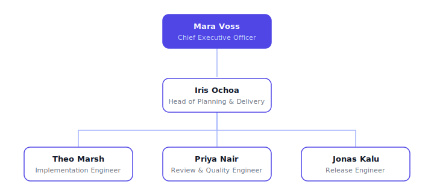

# Relay Engineering

A development-lifecycle company that runs software work as a relay: tasks are discovered and ranked, planned into executable briefs, built as atomic commits, held at a multi-pass review gate, and shipped to production through a runbook — with an explicit, written handoff at every leg. The house rule: discovery is not planning, planning is not building, building is not reviewing, reviewing is not shipping.

## Org structure

- **Mara Voss — Chief Executive Officer** (`ceo`, root): owns intake, ranks the queue, writes definitions of done, dispatches to the Planner, arbitrates escalations.
- **Iris Ochoa — Head of Planning & Delivery** (`planner`, reports to ceo): runs codebase recon, writes implementation briefs and cycle plans, manages the Delivery team.
  - **Theo Marsh — Implementation Engineer** (`builder`): executes briefs into atomic tested commits, runs cleanup and delivery checks, escalates divergence instead of improvising.
  - **Priya Nair — Review & Quality Engineer** (`reviewer`): holds the four-pass review gate (correctness, security, performance, tests) with real authority to bounce.
  - **Jonas Kalu — Release Engineer** (`shipper`): walks the release runbook, syncs docs and changelog, watches the deploy, rolls back on trigger.

**Team:** Delivery (managed by the Planner; Builder, Reviewer, Shipper).

**Skills (8):** task-discovery, sprint-plan, codebase-recon, implementation-brief, cleanup-pass, review-gate, delivery-check, release-runbook.

**Project:** Lifecycle Bootstrap — map the backlog into a ranked queue and cycle plan, then run one small change through every leg to prove the pipeline.

## Curation note

The upstream organization models its lifecycle around executive personas (chief roles doing discovery and planning directly) with a 14-skill toolchain that includes cross-tool consultation, debate, and performance-lab tooling. This adaptation restructures the same pipeline into a planner-managed delivery pod with dedicated build, review, and ship roles, and condenses the toolchain to the eight most load-bearing lifecycle playbooks — intake, planning, recon, briefing, cleanup, gating, verification, and release — rewritten as platform-neutral practice guides.

## Credit

Concept adapted from [AgentSys Engineering](https://github.com/paperclipai/companies/tree/main/agentsys-engineering) (and its source, [agent-sh/agentsys](https://github.com/agent-sh/agentsys)); all content is original.
