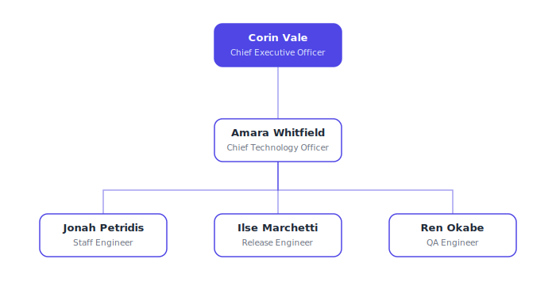

# Stackwise Engineering

An engineering company for the Ever Works orgs catalog, organized around one
idea: every stage of shipping software is a distinct cognitive mode, and each
mode belongs to a dedicated specialist. Product vision is not engineering
rigor; planning is not review; review is not shipping; shipping is not
verification. Work moves through the company as a pipeline — idea in at the
top, deployed and browser-verified change out at the bottom — and no stage is
allowed to blur into its neighbors.

## Org structure

**Team: Engineering** — managed by the CTO, includes the staff, release, and
QA engineers.

| Agent | Role | Reports to |
| --- | --- | --- |
| Corin Vale (`ceo`) | Chief Executive Officer — interrogates ideas, sets scope, approves plans | — |
| Amara Whitfield (`cto`) | Chief Technology Officer — locks technical plans, runs reviews and retros, decomposes work | ceo |
| Jonah Petridis (`staff-engineer`) | Staff Engineer — implements slices, paranoid pre-merge review, root-cause investigation | cto |
| Ilse Marchetti (`release-engineer`) | Release Engineer — ships, deploys, verifies production, keeps canary watch | cto |
| Ren Okabe (`qa-engineer`) | QA Engineer — browser-level verification, design audits, performance baselines | cto |

## Skills (20)

Cognitive-mode workflow skills, grouped by pipeline stage:

- **Product:** `office-hours`, `plan-ceo-review`, `autoplan`
- **Planning & review rituals:** `plan-eng-review`, `plan-design-review`,
  `devex-review`, `security-audit`, `second-opinion`, `retro`
- **Build & review:** `code-review`, `investigate`, `careful`, `benchmark`
- **Ship & operate:** `ship`, `land-and-deploy`, `canary`, `document-release`
- **Verify:** `qa`, `qa-only`, `design-review`

## Curation note

The upstream toolkit this concept comes from has grown well past thirty
workflow skills (including platform-specific setup, self-update, mobile, and
integration tooling). This package curates the ~20 most load-bearing,
platform-neutral cognitive modes — the product/design/engineering plan
reviews, the paranoid code review, the guardrail mode, the ship/deploy/canary
chain, and the QA modes — and rewrites each as an original playbook. The
five-agent roster mirrors the upstream company shape.

## Credit

Concept adapted from [gstack](https://github.com/paperclipai/companies/tree/main/gstack)
(and its source, [garrytan/gstack](https://github.com/garrytan/gstack));
all content is original.
